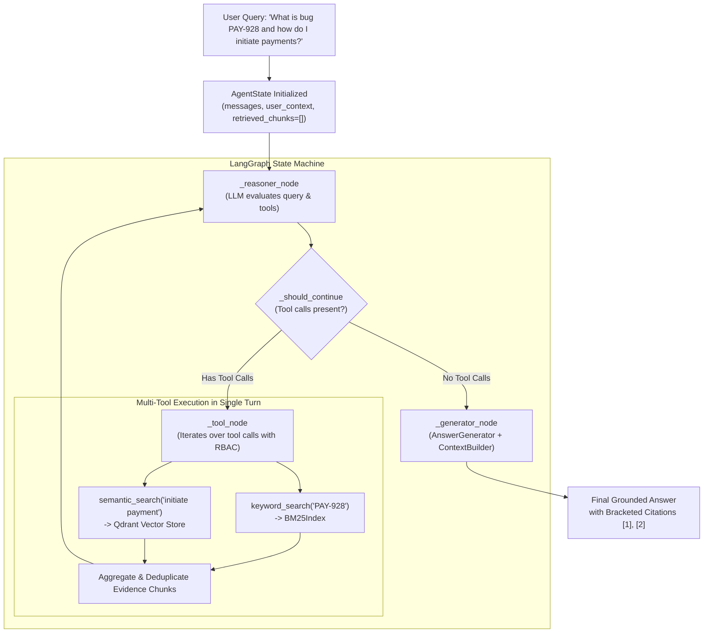

# Phase 5 Verification Guide: Keyword Search Retrieval & LangGraph Multi-Tool Orchestration

This document details the architecture, execution workflow, and test verification for **Phase 5: Keyword Search Retrieval Tool & LangGraph Multi-Tool Integration**.

---

## 🎯 Phase 5 Objectives & Deliverables

1. **`KeywordRetriever` (`backend/retrieval/keyword.py`)**:
   - High-level lexical retrieval layer wrapping `BM25Index` (using `BM25Plus`).
   - Exact identifier lookups (Jira issue keys `PAY-928`, PR numbers `#1842`, error codes `HTTP 401`, code symbols `AuthService.charge`).
   - Strict database-level Role-Based Access Control (RBAC) pre-filtering.
   - 100% preservation of chunk payload metadata.

2. **Dual Tool Registration in `ToolRegistry` & `langchain_tools.py`**:
   - `create_default_tool_registry()` now equips agents with both `semantic_search` and `keyword_search`.
   - `create_langchain_tools()` provides native LangChain `StructuredTool` instances compatible with LangGraph's `ToolNode` and standard tool-calling graphs.

3. **Multi-Tool Planning in LangGraph StateGraph**:
   - Upgraded reasoner prompting to guide LLMs on tool selection.
   - Validated that the reasoner node can emit multiple tool calls in a single turn (`keyword_search` + `semantic_search`).
   - `_tool_node` executes all requested tools, aggregates retrieved evidence chunks, and forwards combined results to the next turn.

---

## 🏗️ Architecture & Message Flow



---

## 🧪 Automated Test Suite

Run the full Phase 5 test suite:

```bash
# Run KeywordRetriever unit tests
python backend/retrieval/tests/test_keyword_retriever.py

# Run LangGraph multi-tool tests
python backend/agent/tests/test_langgraph_agent.py
```

### Test Coverage Summary:
- ✅ `test_keyword_retriever.py` (4/4 Passed):
  - Exact token and symbol matching (`PAY-928`, `HTTP 401`, `AuthService.validate_token`).
  - Strict RBAC pre-filtering at database layer.
  - Source and resource type metadata filtering.
  - Full metadata preservation.
- ✅ `test_langgraph_agent.py` (6/6 Passed):
  - StateGraph node and edge compilation.
  - Autonomous single-tool loop.
  - RBAC isolation inside `AgentState`.
  - Native LangChain StructuredTool execution.
  - Multi-tool single-turn parallel execution (`keyword_search` + `semantic_search`).

---

## 🚀 Live Visual Verification

Run the end-to-end Phase 5 demonstration:

```bash
python scripts/verify_phase5.py
```
