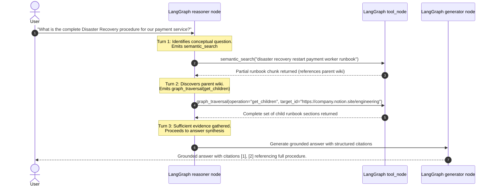

# Phase 6 Verification & Technical Report: Graph & Resource Lookup Tools with LangGraph Multi-Hop Reasoning

**Date:** 2026-09-22  
**Status:** ✅ Verified & Complete (100% Test Suite & Live Demo Passing)  
**Execution Script:** [`scripts/verify_phase6.py`](file:///Users/ompatil/Desktop/Enterprise-Knowledge-Agent/scripts/verify_phase6.py)  
**Unit Tests:**
- [`backend/retrieval/tests/test_graph_retrievers.py`](file:///Users/ompatil/Desktop/Enterprise-Knowledge-Agent/backend/retrieval/tests/test_graph_retrievers.py) (9/9 passed)
- [`backend/agent/tests/test_langgraph_agent.py`](file:///Users/ompatil/Desktop/Enterprise-Knowledge-Agent/backend/agent/tests/test_langgraph_agent.py) (9/9 passed)

---

## 1. Executive Summary

Phase 6 completes the four-modality enterprise retrieval toolset within our LangGraph state machine:
1. **`semantic_search`**: Dense vector semantic retrieval (`Qwen/Qwen3-Embedding-0.6B` + Qdrant) for conceptual questions and guides.
2. **`keyword_search`**: Sparse BM25+ inverted index for exact technical identifiers, Jira keys (e.g. `PAY-928`), PR numbers, and code symbols.
3. **`resource_lookup`**: Deterministic direct lookup (`ResourceLookupRetriever`) by canonical URI, URL, chunk ID, or exact title with sequential multi-chunk document reconstruction and outline stitching.
4. **`graph_traversal`**: Structural knowledge graph traversal (`GraphRetriever`) enabling parent-child hierarchy navigation (`get_children`), horizontal bidirectional sibling expansion (`get_neighbors`), and ordered procedural sequence assembly (`get_full_sequence`).

---

## 2. Structural Architecture & Graph Traversal Topology

```
                         ┌─────────────────────────────────┐
                         │   LangGraph StateGraph Agent    │
                         └───────────────┬─────────────────┘
                                         │
                 ┌───────────────────────┴───────────────────────┐
                 │                   _tool_node                  │
                 └───────┬───────────────┬───────────────┬───────┘
                         │               │               │
                         ▼               ▼               ▼
                 ┌──────────────┐ ┌──────────────┐ ┌──────────────┐
                 │resource_look-│ │graph_traver- │ │semantic_&_kw │
                 │     up       │ │     sal      │ │   search     │
                 └───────┬──────┘ └──────┬───────┘ └──────┬───────┘
                         │               │                │
                         ▼               ▼                ▼
     ┌────────────────────────────────────────────────────────────┐
     │            Dual-Index Storage & Memory Graph Topology      │
     ├─────────────────────────────┬──────────────────────────────┤
     │  BM25 In-Memory Store       │  Qdrant Vector Engine        │
     │  - parent_id indexing       │  - Dense cosine index        │
     │  - prev / next chunk links  │  - Database-level RBAC       │
     │  - sequence_id workflows    │  - Multi-tenant isolation    │
     └─────────────────────────────┴──────────────────────────────┘
```

### Graph Navigation Capabilities:
1. **Parent-Child Hierarchy Navigation (`get_children`)**:
   - Traverses root repositories $\to$ child files and issues (`https://github.com/company/payments` $\to$ `docs/api.md`, `src/engine.py`).
   - Traverses workspace wikis $\to$ child pages and playbooks (`https://company.notion.site/engineering` $\to$ `dr-runbook`).
2. **Horizontal Bidirectional Sibling Expansion (`get_neighbors`)**:
   - Follows `prev_chunk_id` $\leftrightarrow$ `next_chunk_id` chain links.
   - Recovers surrounding contextual steps (`window_before`, `window_after`) around any matched section or runbook step.
3. **Procedural Sequence Assembly (`get_full_sequence`)**:
   - Reconstructs complete multi-step procedures (e.g. Disaster Recovery Step 1 $\to$ Step 2 $\to$ Step 3) in ascending order.
4. **Zero-Embedding Resource Stitching (`ResourceLookupRetriever.get_document`)**:
   - Aggregates all chunks of a multi-section document, sorts by `chunk_index`, stitches full markdown bodies, extracts hierarchical section paths, and reports `is_complete: bool`.

---

## 3. Database-Level RBAC Pre-Filtering Across All Graph Hops

Security boundaries are enforced at query time before graph expansion:
- **Public Documents**: Available to all authenticated callers.
- **Role-Restricted Resources**: Only matched if `user_context.roles` intersects `allowed_roles`.
- **User/Group Restrictions**: Checked against `allowed_users` and `allowed_groups`.
- **Graph Traversal Isolation**: In parent-child exploration (`get_children`), unauthorized children (e.g. `notion://vault/master`) are omitted from the returned subgraph for standard engineers while remaining visible to `security-admin`.

---

## 4. LangGraph Multi-Hop Reasoning Loop

The LangGraph agent executes multi-turn, multi-hop reasoning dynamically:



---

## 5. Test Suite & Verification Results

### A. Dedicated Graph Retrieval Suite ([`backend/retrieval/tests/test_graph_retrievers.py`](file:///Users/ompatil/Desktop/Enterprise-Knowledge-Agent/backend/retrieval/tests/test_graph_retrievers.py))
- `test_01_lookup_by_resource_id_and_url`: ✅ PASSED
- `test_02_lookup_by_chunk_id`: ✅ PASSED
- `test_03_lookup_by_exact_title`: ✅ PASSED
- `test_04_get_document_sequential_stitching`: ✅ PASSED
- `test_05_resource_lookup_rbac`: ✅ PASSED
- `test_06_get_children_hierarchy`: ✅ PASSED
- `test_07_get_neighbors_sibling_expansion`: ✅ PASSED
- `test_08_get_full_sequence_procedure_assembly`: ✅ PASSED
- `test_09_graph_traversal_rbac_enforcement`: ✅ PASSED

### B. LangGraph Agent Suite ([`backend/agent/tests/test_langgraph_agent.py`](file:///Users/ompatil/Desktop/Enterprise-Knowledge-Agent/backend/agent/tests/test_langgraph_agent.py))
- `test_01_graph_compilation`: ✅ PASSED
- `test_02_autonomous_langgraph_tool_loop`: ✅ PASSED
- `test_03_langgraph_rbac_isolation`: ✅ PASSED
- `test_04_native_langchain_tools_execution` (all 4 tools): ✅ PASSED
- `test_05_multi_tool_execution_in_single_turn`: ✅ PASSED
- `test_06_native_keyword_search_langchain_tool`: ✅ PASSED
- `test_07_resource_lookup_in_langgraph_loop`: ✅ PASSED
- `test_08_graph_traversal_in_langgraph_loop`: ✅ PASSED
- `test_09_multihop_reasoning_flow`: ✅ PASSED

### C. Live Verification Script ([`scripts/verify_phase6.py`](file:///Users/ompatil/Desktop/Enterprise-Knowledge-Agent/scripts/verify_phase6.py))
- Step 1: Ingested 5 OKF Documents & 11 linked SmartChunks: ✅ PASSED
- Step 2: Resource Lookup & Sequential Stitching: ✅ PASSED
- Step 3: Graph Traversal & Sibling Expansion: ✅ PASSED
- Step 4: Native LangChain 4-Tool Suite: ✅ PASSED
- Step 5: Multi-Hop LangGraph Agent Execution: ✅ PASSED
